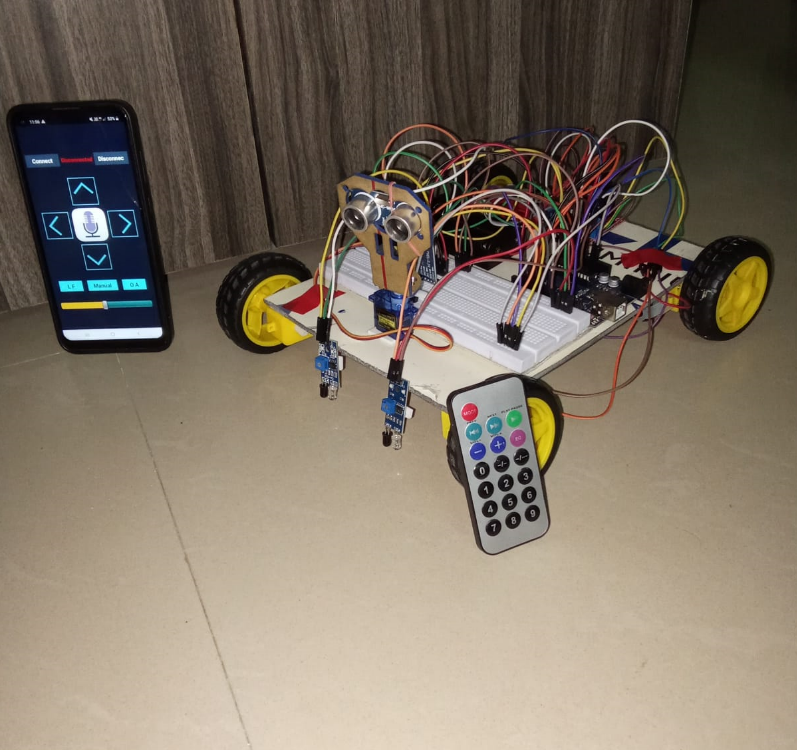

# 🤖 4-in-1 Multipurpose Robot

The **4-in-1 Multipurpose Robot** is an intelligent and versatile robot car built with Arduino UNO, combining multiple functionalities into one compact system — including **obstacle avoidance**, **line following**, **Bluetooth control**, and **IR remote operation**.

Designed using low-cost, modular components, this robot offers a hands-on experience in embedded systems, robotics, and mobile control. It's the perfect project for students, hobbyists, and tinkerers looking to explore real-world robotics.

---

## 🔍 Project Overview

This robot supports **4 different modes of operation**:
- 🚗 **Bluetooth Mode** – Control via Android phone using a custom MIT App Inventor app
- 📡 **IR Remote Mode** – Control using a standard MP3 IR remote
- 🔁 **Obstacle Avoidance Mode** – Moves autonomously by detecting obstacles
- ➿ **Line Following Mode** – Follows a black line using IR sensors

It uses an **Arduino UNO** as the brain and various sensors/modules for real-time environment interaction and user commands.

---

## 🚀 Features

| Feature | Description |
|--------|-------------|
| 🔄 **Obstacle Avoidance** | Uses ultrasonic sensor (HC-SR04) to detect and avoid obstacles |
| ➿ **Line Following** | Follows black lines using dual IR sensors |
| 📱 **Bluetooth Control** | App-based control using HC-05 module and custom Android app |
| 📡 **IR Remote Control** | Use IR remote to give directional and functional commands |
| 🎙️ **Voice Recognition** | Voice control supported via MIT App |
| ⚙️ **Speed Control** | Adjustable speed through a slider in the mobile app |

---

## 🧰 Hardware Components

| Component | Purpose |
|----------|---------|
| Arduino UNO | Main microcontroller |
| L298 Motor Driver | Drives the 4 DC motors |
| DC Gear Motors ×4 | Drives the robot wheels |
| HC-SR04 Ultrasonic Sensor | For obstacle detection |
| IR Sensors ×2 | For line following |
| HC-05 Bluetooth Module | Enables mobile control |
| IR Receiver Module | Accepts commands from IR remote |
| MP3 Player Remote | Controls direction and modes |
| SG90 Servo Motor | Rotates ultrasonic sensor for scanning |
| 18650 Battery Cell ×2 | Power supply (7.4V total) |
| 18650 Battery Holder | Holds batteries |
| On/Off Switch | Powers robot on/off |
| Acrylic Chassis (20x12 cm) | Main robot frame |
| Robot Car Tyres ×4 | Mobility |
| Jumper Wires (M-F) | Circuit connections |

---

## 🔧 How It Works

1. **Power System**  
   - 2 × 18650 cells give 7.4V  
   - Controlled using a toggle **on/off switch**

2. **Core Logic**  
   - Arduino UNO receives data from IR sensors, HC-SR04, Bluetooth, and IR remote  
   - Based on mode selected (via remote or mobile app), Arduino controls movement

3. **Movement**  
   - Motors are driven using **L298 motor driver**  
   - Servo motor rotates ultrasonic sensor for obstacle scanning

4. **Control Options**  
   - Mobile App: Manual control, voice control, auto modes  
   - IR Remote: 
     - `>` → Stop  
     - `+` → Forward  
     - `-` → Backward  
     - `>>|` → Right  
     - `|<<` → Left  
     - `1` → Obstacle Avoidance  
     - `2` → Line Follower  
     - `3` → Manual Mode

---

## 🛠️ Setup Instructions

1. **Assemble the chassis** with motors, wheels, and battery pack
2. **Connect all modules** (Bluetooth, IR sensor, ultrasonic, IR receiver) to Arduino as per circuit diagram
3. **Upload Arduino code** using Arduino IDE
4. **Power ON** the robot using the switch
5. **Control the robot**:
   - Using the **MP3 IR remote**
   - Or via the **Android app** (built with MIT App Inventor)
6. **Test each mode**:
   - Line following on black tape track
   - Obstacle avoidance with hand or wall
   - Bluetooth manual control via phone

---

## 📸 Media

> *(media/robot_photo.png)*

```markdown

